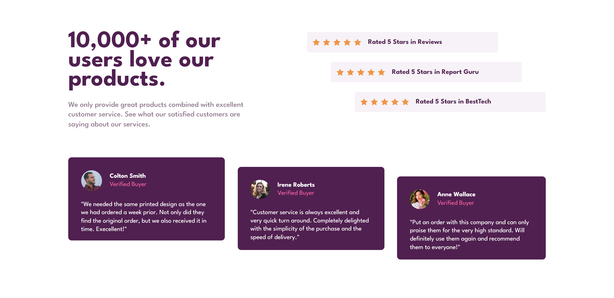
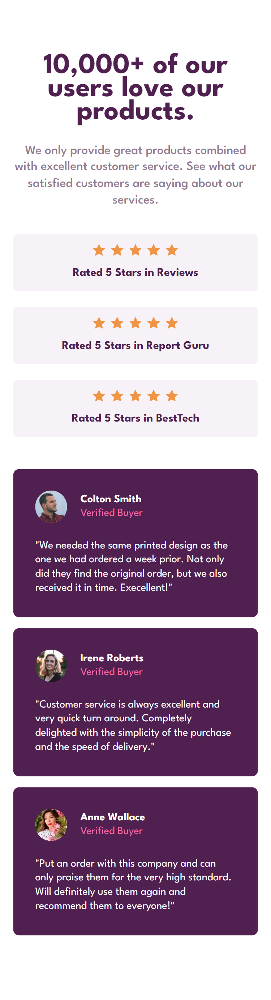

# Frontend Mentor - Social proof section solution

This is a solution to the [Social proof section challenge on Frontend Mentor](https://www.frontendmentor.io/challenges/social-proof-section-6e0qTv_bA). Frontend Mentor challenges help you improve your coding skills by building realistic projects. 

### The challenge

Users should be able to:

- View the optimal layout for the section depending on their device's screen size

### Screenshots

- Desktop layout

- Mobile layout

### Links

- Solution URL: [github - yorchAdalbert](https://github.com/yorchAdalbert/social-proof-section-master)
- Live Site URL: [stats-preview-card](https://yorchadalbert.github.io/social-proof-section-master/src/)

## My process

- Worked on the the project's file structure
- Worked on the html structure
- Worked on typography
- Worked on mobile layout first
- Worked on desktop layout

### Built with

- HTML5 markup
- CSS custom properties
- Flexbox
- Mobile first
- SASS

### What I learned

I learned to apply two background images inside the body

### Useful resources

- [css-tricks](https://css-tricks.com/css-basics-using-multiple-backgrounds/) - I learned to use multiple backgrounds

### Author

- Website - [Jorge Rodriguez](http://www.yorchadalbert.com)
- Frontend Mentor - [@yorchAdalbert](https://www.frontendmentor.io/profile/yorchAdalbert)
